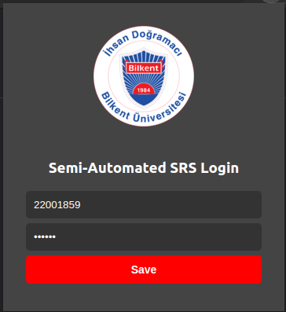

# Semi-Automated-SRS-Login
This extension automatically fills the credentials in the login page of the SRS and redirects you to the verification page. You only need to enter your credentials once in the extension window. Credentials are stored locally; there is no transmission of data externally.
 

  

